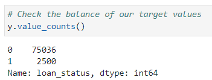

# Credit-Risk-Classification

## Overview of the Analysis

I have completed a credit risk analysis on the lending data set. As I was trying to predict the `loan_status` of each loan, classifying them into 0 (healthy loan) and 1 (high-risk loan). 

Firstly, I separated the data into the labels `loan_status` and the rest for the features. I then used `value_counts()` to check the balance of the labels variable. It showed that this data is imbalanced. Then I split the data into training and testing data sets. 

Secondly, I have created a Logistic Regression model with the original data. I used the `LogisticRegression` module from sklearn. I instantiated, fitted and predicted with the model. Once I had the predictions, I evaluated the model's performance by calculating the balanced accuracy score, generating a confusion matrix and printing the classification report for the model.

Thirdly, as I found this data is hugely imbalanced, I resampled the data with the `RandomOverSampler` module from imbalanced-learn. Once I had gained the resampled data and counted the distinct values of the resampled labels data with `value_counts()`, I confirmed that the labels have an equal number of data points. I then instantiated the Logistic Regression model, fitted and predicted with the oversampled data. Again I evaluated the model's performance by calculating the balanced accuracy score, generating a confusion matrix and printing the classification report for the model.

## Results
* Machine Learning Model 1: Logistic Regression Model with the Original Data
  * Balanced Accuracy Score: 0.95
  * Precision Score: 0.99
  * Recall Score: 0.99

  

* Machine Learning Model 2: Logistic Regression Model with Resampled Training Data (Random Oversampling)
  * Balanced Accuracy Score: 0.99
  * Precision Score: 0.99
  * Recall Score: 0.99

  

## Summary
Machine learning model 1 has a balanced accuracy score of 95 %, whereas machine learning model 2 has a balanced accuracy score of 99 %. Both of the models have 99% for their precision and recall scores. On the surface, I would say that machine learning model 2 seemed to perform best, as it has a higher balanced accuracy score. 

The balanced accuracy score was chosen to evaluate the model's performance as this is an imbalanced data set. Also, it is undesirable to have false negatives, meaning a loan that is actually a high-risk loan (`1`) but is predicted as a healthy loan (`0`). It is more important to predict the high-risk loans (`1`). In this case, the recall score is important. And the balanced accuracy score is defined as the average of recall obtained on each class.

However, I do not intend to recommend any models, as the random oversampling approach might not be close to the real-life situation. Because random oversampling duplicates examples from the minority class in the training dataset and can result in overfitting for some models. In the original data set, we can see that there were only 2500 data points classified as class `1`. In the resampled data, it became 56271. Instead, my recommendation is to collect more data, so the machine learning model can make predictions closer to real-life situations.

